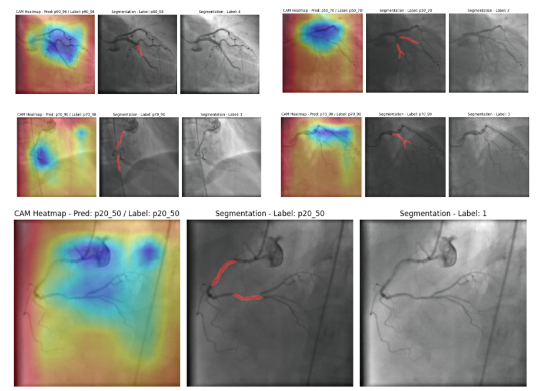

# 🫀 Coronary Artery Stenosis Analysis: Integrated Segmentation and Grading

### 🚀 Project Overview

This repository hosts the code for an **advanced deep learning model** designed for the **automated analysis of Coronary Artery Stenosis (CAS)** from **X-ray Angiography** images.

The system performs two crucial tasks simultaneously:

1. **🩻 Vessel Segmentation:**
   Accurately identifies and segments coronary arteries using a **Transformer-based U-Net** architecture.

2. **📊 Stenosis Grading:**
   Classifies the severity of coronary artery blockage using a **Bottleneck Classifier** trained on deep feature representations from the segmentation encoder.

🔗 **Live Demo:**
👉 [Hugging Face Spaces App]([https://rajaatif786-ai4stenosis.hf.space](https://www.bioaml.com/angiography))

---


## 🎯 Architecture Details

The core of this solution is a **two-module system** leveraging **transfer learning**.

| Module                | Model Architecture          | Purpose                                                                                                 |
| --------------------- | --------------------------- | ------------------------------------------------------------------------------------------------------- |
| **Encoder Backbone**  | MiT-B5 (Mix Transformer B5) | Extracts rich, multi-scale features, capturing long-range dependencies in vascular structures.          |
| **Segmentation Head** | U-Net Decoder               | Reconstructs the segmentation mask from encoder features, predicting a binary mask (vessel/background). |
| **Grading Head**      | Bottleneck Classifier       | Maps the bottleneck features (final encoder output) to one of five stenosis severity classes.           |

---

## 💡 Stenosis Grading Classes

The classification model predicts **one of 5 severity grades**, based on the degree of arterial narrowing:

| Class ID | Grade Label | Description (Percentage Stenosis) |
| -------- | ----------- | --------------------------------- |
| 0        | p0_20       | Minimal (0–20%)                   |
| 1        | p20_50      | Mild/Moderate (20–50%)            |
| 2        | p50_70      | Severe (50–70%)                   |
| 3        | p70_90      | Critical (70–90%)                 |
| 4        | p100        | Total Occlusion (100%)            |

---

## ⚙️ Local Setup and Installation

### 🧬 Prerequisites

* Python 3.8+
* pip

### 🫼 Step 1: Clone the Repository

```bash
git clone [YOUR_REPOSITORY_URL_HERE]
cd [YOUR_REPOSITORY_NAME]
```

### 🫼 Step 2: Install Dependencies

The required libraries are listed in `requirements.txt`.

```bash
pip install -r requirements.txt
```

### 🫼 Step 3: Download Model Weights (MANDATORY)

The application requires two separate model weights.
The Python script automatically downloads them via `gdown` if not found locally,
but you can also download them manually:

| Model                                   | File Name                            | Google Drive Link                                                                                   |
| --------------------------------------- | ------------------------------------ | --------------------------------------------------------------------------------------------------- |
| Segmentation Weights (MiT-B5 U-Net)     | `model_mit_b5_256_best_dice.pth`     | [Download Here](https://drive.google.com/file/d/1sytzRSEoSI6T2bKPOrl_iP-FoUmjcCju/view?usp=sharing) |
| Grading Classifier Weights (Bottleneck) | `unet_bottleneck_classifier.pth` | [Download Here](https://drive.google.com/file/d/1R49zTOrS76ghkkcvgHflgW7Tm9S0nszW/view?usp=sharing) |

️ Place both files in the **root directory** for proper loading.

### 🫼 Step 4: Run the Application

```bash
python "app (21).py"
```

A local **Gradio interface** will launch.
Access it in your browser at the provided localhost URL, e.g.:

```
http://127.0.0.1:7860
```

---

## 📁 Repository Files

| File               | Description                                           |
| ------------------ | ----------------------------------------------------- |
| `app (21).py`      | Main Gradio application and prediction logic.         |
| `grading_model.py` | Custom PyTorch modules and grading utility functions. |
| `requirements.txt` | List of required Python dependencies.                 |
| `README.md`        | Project documentation file.                           |

---

## 🧠 Technologies Used

* Python
* PyTorch
* Hugging Face (Gradio Spaces)
* Transformer (MiT-B5 Backbone)
* U-Net Architecture
* Medical Image Segmentation and Classification

---

## 📜 License

Released under the **MIT License** — you are free to use, modify, and distribute this code with proper attribution.

---

## 👨‍🔬 Author

**Raja Atif Aurang Zaib**
AI Researcher | Virology & Biomedical Imaging | Deep Learning Enthusiast
[Hugging Face Profile](https://huggingface.co/rajaatif786)

---

⭐ If you find this repository useful, don’t forget to give it a star!
